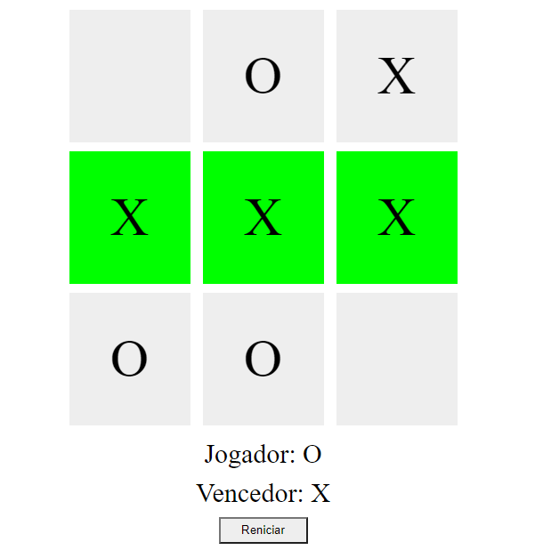

  
     
  Criando seu próprio jogo da velha com HTML e Javascript

- Desafio prático realizado na plataforma [Digital Innovation One](https://web.digitalinnovation.one/home "Digital Innovation One"): [Criando seu próprio jogo da velha com HTML e Javascript](https://web.digitalinnovation.one/lab/criando-seu-proprio-jogo-da-velha-com-html-e-javascript/learning/8efe66a6-6474-483f-86cf-12911d6c6af4 "Criando seu próprio jogo da velha com HTML e Javascript").
